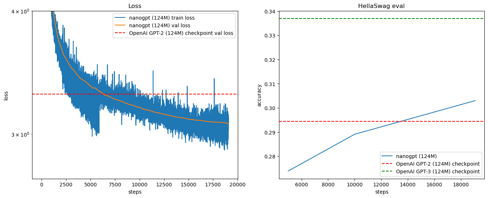

# LLM Training Practice

## Motivation

1. Implement and study the LLM training pipeline from scratch
2. This small-scale LLMs can be future used to explore the potential of high-quality data
3. Prepare for future mechanistic interpretability studies (e.g., probing studies like [Allen-Zhu's Grade School Math](https://physics.allen-zhu.com/part-2-grade-school-math/part-2-1))

## Result

  

## Infra

- GPU: A100 40GB * 2
- pretraining time: around 8 hours

## Components

1. **Dataset**: [Fineweb](https://huggingface.co/datasets/tiiuae/fineweb) (Hugging Face)
2. **Tokenizer**: [tiktoken](https://github.com/openai/tiktoken) (OpenAI)
3. **Model Architecture**: GPT-2 (124M)
4. **Training**: Utilizing hyperparameters from the original GPT-2 paper
5. **Evaluation**: [HellaSwag](https://rowanzellers.com/hellaswag/) benchmark

## Future Enhancements

- [ ] Implement Rotary Embeddings
- [ ] Integrate Flash Attention
- [ ] Explore alternative training frameworks
- [ ] try different pre-train datasets and evaluation benchmarks

## Reference

Youtube: Let's reproduce GPT-2 (124M) https://youtu.be/l8pRSuU81PU?si=0GoawptKxkcdNyyL

